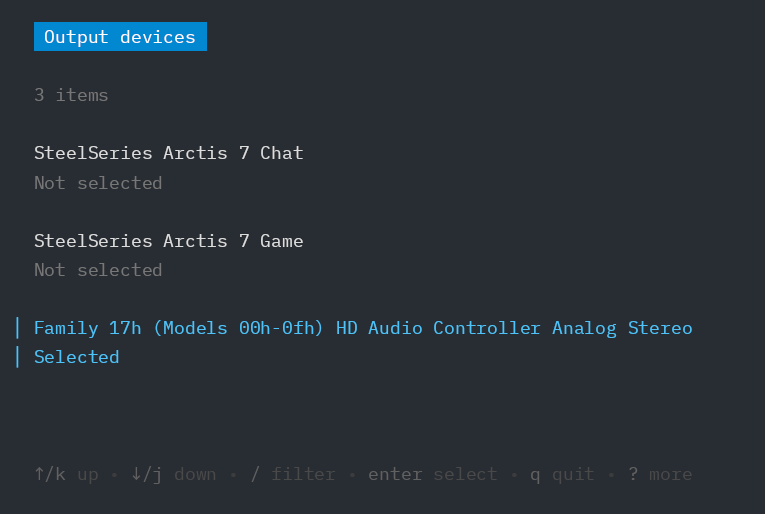

# surr

A simple TUI app for Linux that lists all audio output devices and lets you easily select the primary active device for sound playback.



## Dependencies

You need `pactl` and either `PulseAudio` or `PipeWire` installed.

On Debian based distributions

```bash
sudo apt install -y pulseaudio-utils pulseaudio
```
or
```bash
sudo apt install -y pulseaudio-utils pipewire
```

## Installation

Install from repository
```bash
go install github.com/N30A/surr
```

Build from source
```bash
make build
```

Install from source
```bash
make install
```

Run without building
```bash
make run
```
